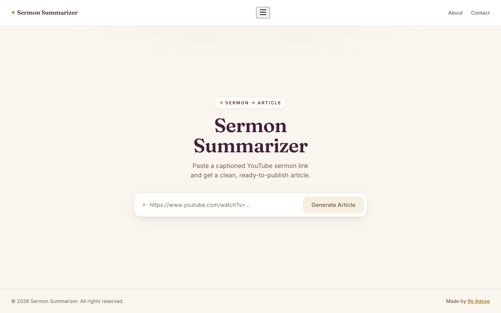

# Sermon Summarizer

A simple web app that turns a YouTube sermon into a ready-to-publish blog article — in one click, on your own free Gemini key.

## What It Does

Paste a YouTube URL, get a clean, well-written reflection back. No transcript extraction, no copy-pasting between tools, no inconsistent LLM outputs.

## How It Stays Free

There is no server and no shared API key. The first time you click Generate, the app asks you to connect your own Gemini key from [Google AI Studio](https://aistudio.google.com/apikey) — free, and allows up to 20 requests and 8 hours of video per key per day. Your browser sends the video link and the writing prompt straight to Google's API. **Your key never touches our servers**, because there aren't any: the site is static. Analytics counts visits and errors and records which video was summarized; it never receives the key or the article.

Gemini watches the video itself, so it works on sermons without captions.

Google's free tier comes with conditions, which the app states before you connect a key: Google may use what you send to improve its products and its reviewers may read it; you must be 18 or older; and in the EEA, UK or Switzerland, Google's terms require a key with billing enabled. See the [Gemini API terms](https://ai.google.dev/gemini-api/terms).

## Why

Writing weekly sermon recaps for a church blog used to require stitching together several unreliable tools by hand. This project collapses that pipeline into a single flow.

## Tech Stack

- **Frontend:** React + Vite, a single page, deployed as a static site on Vercel
- **AI:** Gemini API (Interactions API with YouTube video input), called directly from the browser with the user's key
- **Backend:** none

## Repository Layout

- `frontend/` — the app. See [frontend/README.md](frontend/README.md) for setup, tests and deploy.
- `docs/PLAN.md` — the original MVP plan (historical; see the architecture note at the top).
- `docs/PROMPT_LOG.md` — every change to the writing prompt and why.

## Philosophy

Pilot-first. One input, one button, one output. Build only what's necessary — expand when demand proves the need.
